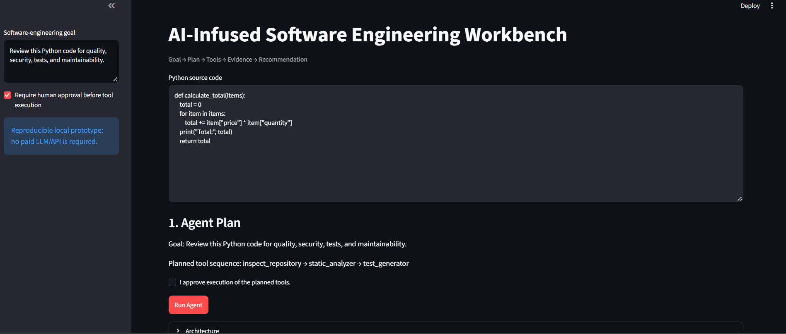
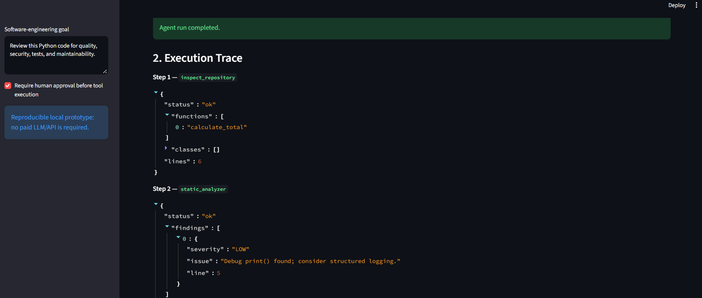

# AI-Infused Software Engineering Workbench

A research-oriented prototype exploring **Agentic AI for Software Engineering** and the engineering requirements of reliable AI agents.

## Topics covered

- Agentic AI in Software Engineering
- Software Engineering for Agentic AI
- Practical agentic concepts
- AI-assisted software development
- Goal-oriented planning
- Tool selection and tool-based agent construction
- Sequential decision-making
- Human-in-the-loop approval
- Software quality, security and maintainability analysis
- Test-generation assistance
- Sustainability-aware engineering
- Agent execution traces and observability
- Ethics, limitations, reliability and future directions

## Architecture

```text
Developer Goal
      ↓
Agent Planner
      ↓
Tool Selection
      ↓
Repository Inspector
Static Analyzer
Test Generator
Sustainability Estimator
      ↓
Evidence + Execution Trace
      ↓
Recommendation
      ↓
Human Review / Approval
```

## What is actually implemented

The agent receives a software-engineering goal, creates a tool-use plan, executes allow-listed local tools, collects structured evidence and produces a recommendation.

Implemented tools:
1. Repository/code inspection using Python AST
2. Static security and maintainability analysis
3. Test-stub generation
4. Heuristic sustainability/efficiency analysis

The prototype is deliberately deterministic and reproducible, so it runs without an API key.

## Important scope note

This is **not** a claim of a fully autonomous LLM agent. It demonstrates agentic software-engineering concepts through planning, tool orchestration, observation, recommendations, human oversight and transparent boundaries.

It does not:
- call an external LLM
- autonomously modify repositories
- execute arbitrary generated code
- provide production-grade security guarantees
- measure real electricity consumption or carbon emissions

## Technologies

Python, Streamlit, Python AST, rule-based program analysis, JSON execution traces and Jupyter Notebook.

## Run locally

```bash
python -m venv venv
```

PowerShell:
```powershell
Set-ExecutionPolicy -Scope Process -ExecutionPolicy Bypass
.\venv\Scripts\Activate.ps1
```

```bash
pip install -r requirements.txt
streamlit run app.py
```

## Suggested experiments

1. Run the default review goal.
2. Toggle human approval and observe the safety boundary.
3. Add `eval()` and inspect the security finding.
4. Add `api_key = "demo-secret"` and inspect the hard-coded-secret finding.
5. Create a long function and inspect the maintainability finding.
6. Change the goal to mention sustainability/performance and observe the extra tool.
7. Export the agent execution trace as JSON.

## Future research

- LLM-based planning
- Retrieval-augmented repository understanding

## Screenshots

### 1. Agent Planning

The system converts a software-engineering goal into a sequence of tools to execute, demonstrating goal-oriented planning and agentic tool orchestration.



### 2. Agent Execution Trace

The system records each tool invocation and its structured output, providing an observable and auditable execution trace.


- Sandboxed execution
- Automated test execution and repair
- Multi-agent software review
- Agent reliability benchmarks
- Human-agent interaction studies
- Real energy/carbon measurement
- Agent observability and failure recovery
